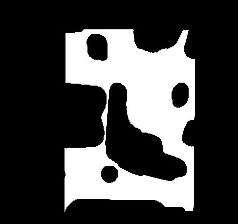
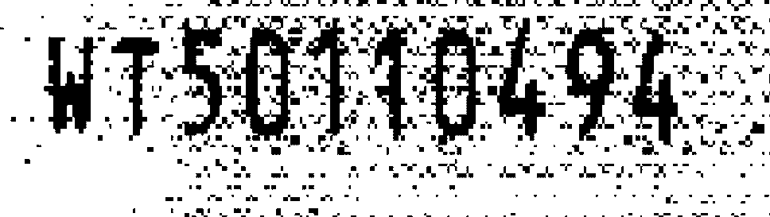
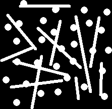
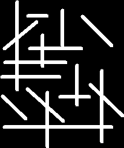
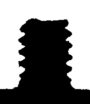
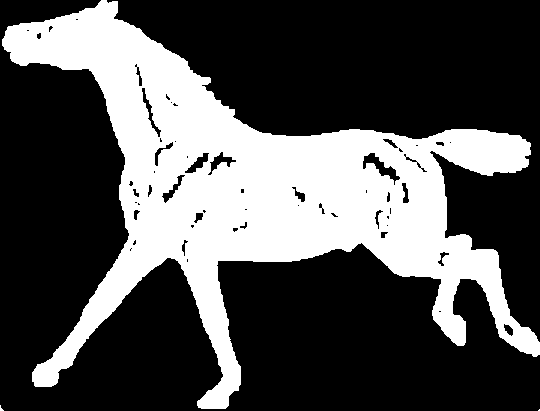
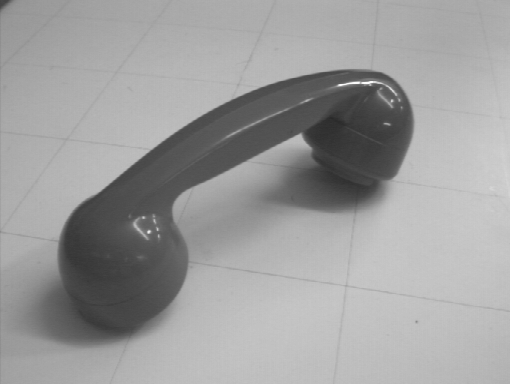
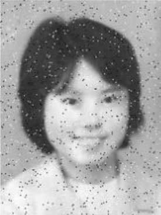
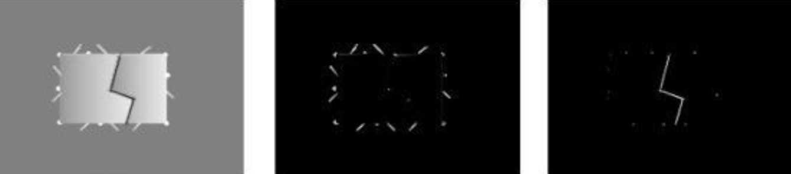

# hw3

1.测试图像的测试腐蚀、膨胀、开、闭运算

2.去噪

3.去除杆状结构

4.分离水平垂直杆

5.顶帽运算与底帽运算

6.修复区域

7.去除高光区域后分割电话话筒

8.形态学滤除黑白噪声点后计算形态学梯度

9.从左图分离得到右侧两图的结果

### Structure

[`code/`](./code/)中为作业的代码

[`images/`](./images/)中为作业使用的图片

[`results/`](./results/)中为每张图片对应任务的实现

